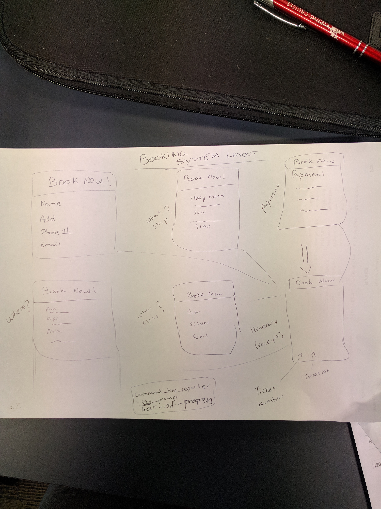
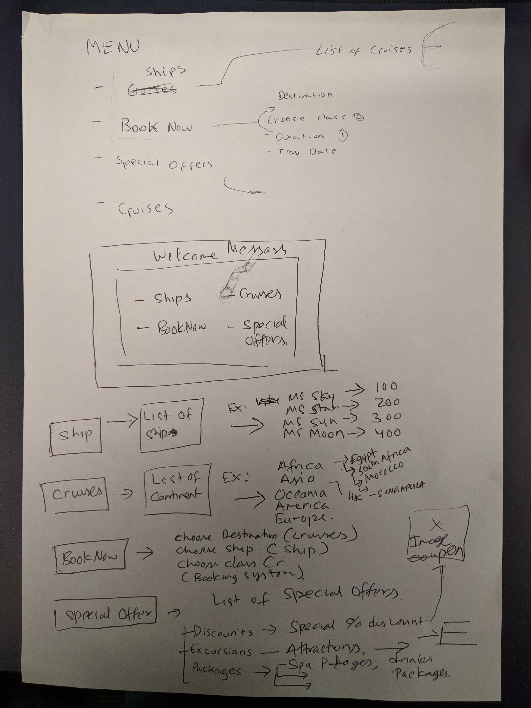
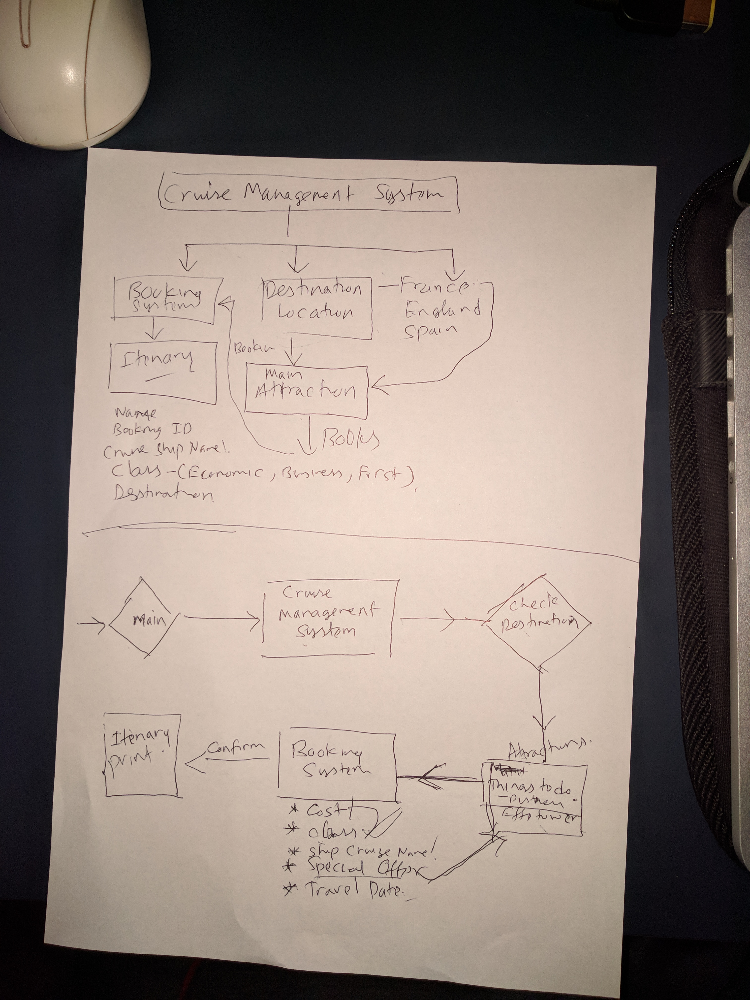

# MSOC 
@mikemgm @shaktigurung

**Link to GitHub repo:** https://github.com/shaktigurung/MSOC 

**App Description:** 

Our project is a travel application to book cruise ship vacations. The purpose of this app is for customers to navigate through our application and go through a booking process which lets them decide their destination, cruise model, accommodation class and duration of the trip. 

The function of our application shows the user destination options, different ship models, and a booking system that lets them purchase a cabin for their upcoming trip.

Instructions: 
The user starts up the app in terminal and a welcome menu is displayed as well as an image of our company logo. In the menu, the user has five options to chose from these are: 

>1.(Available Destinations)  

>2.(Cruise Models)   

>3.(Book Now)  

>4.(Special Offers)  

>5.(Exit the app) 

The user can navigate through the app and always have the option to return to the main menu. The user should take a look at the available destinations and ship models to be better informed and know what to choose when booking. Once the booking process is complete the user receives an itinerary listing all the guest details, booking number, destination and duration of trip, total payment made and embarkation date. 

*MAIN MENU*

 

*SHIPS SCREEN*

*CRUISE VOYAGE SCREEN*

 

*BOOKING SCREEN*

*ITINERARY SCREEN*

**Details of Design & Planning Process:** 

*Booking System*

 

*Menu* 

*Work Flow Diagram* 

Trello Outline Board

 

 

